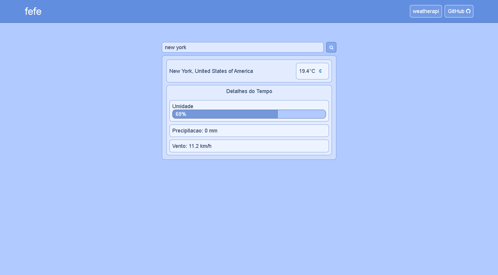
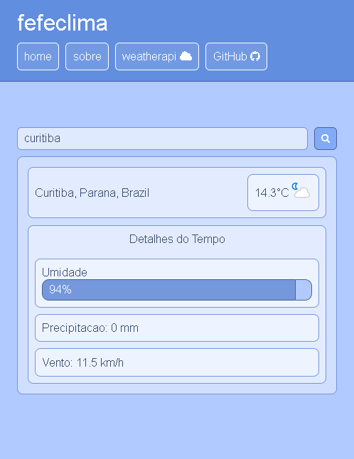

# Projeto de API de clima ☁️💙
Este projeto é um estudo React. Ele busca pelo local inserido e, se encontrado, retorna as informações do clima atual. 
Os dados são retirados da API gratuita WeatherAPI, portanto, podem estar incorretos ou atrasados.

